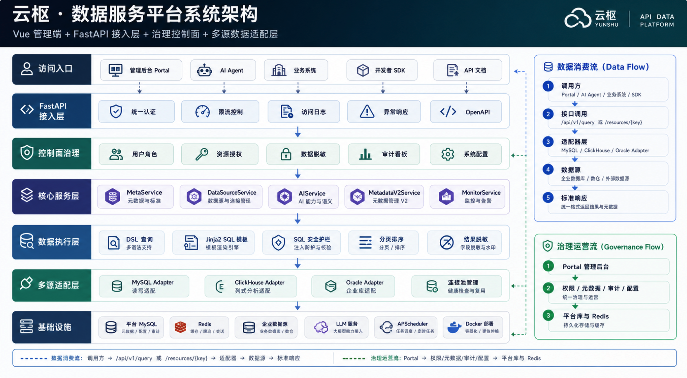
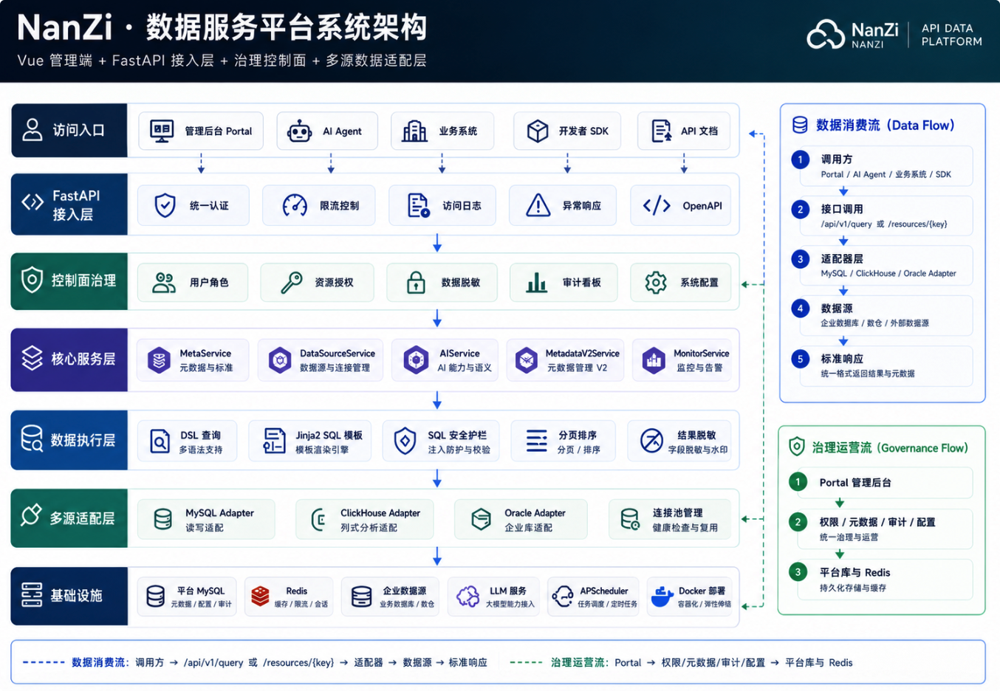
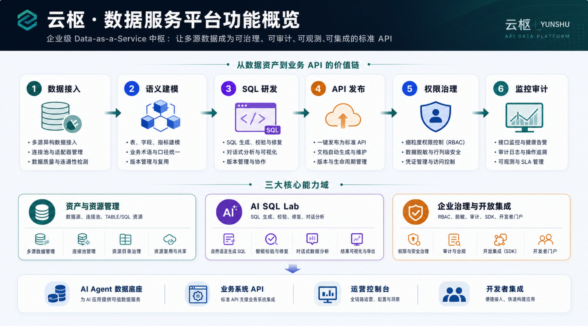

# 云枢 · 数据服务平台 (Yunshu API Data Platform)

**简体中文** | [English](README_EN.md)

> **企业级 Data API 与元数据治理平台**  
> *Connect Data. Serve Intelligence.*

[](https://www.python.org/) [](https://fastapi.tiangolo.com/) [](https://vuejs.org/) [](https://tailwindcss.com/) [](https://clickhouse.com/) [](https://www.mysql.com/) [](https://redis.io/) [](LICENSE)



**云枢 · 数据服务平台**是面向企业数据消费场景的一站式 **Data-as-a-Service (DaaS)** 中枢。它将物理表、自定义 SQL 与语义元数据统一封装为可治理、可审计、可观测的 RESTful API，为 AI Agent、运营控制台与业务系统提供标准化数据访问能力。

平台核心聚焦于以下能力矩阵：

*   🚀 **动态资源服务化 (Resource-as-an-API)**：`TABLE` 零代码映射与 `SQL` 复杂逻辑封装双模式；Jinja2 动态模板 + 统一 DSL 查询入口。
*   🧪 **SQL 实验室 (SQL Lab)**：在线编写、调试、AI 辅助生成与修复 SQL，一键发布为生产 API 资源。
*   🗂️ **元数据与数据源治理**：多源连接管理（MySQL / ClickHouse / Oracle）、语义元数据、健康度评分与 RBAC 细粒度授权。
*   🛡️ **企业级安全审计**：按天分表审计日志、AST 静态 SQL 护栏、API Key + Session 双认证、数据脱敏策略。
*   📊 **全链路可观测性**：24h/7d 调用趋势、Top 排行、分钟级统计聚合、连接池健康监控。
*   🔌 **开放集成**：标准化 `/api/v1` 对外接口与管理后台 Portal API，可作为上游 **云枢 · 智能体平台** 的数据底座。

---

## 🏛️ 系统架构 (Architecture)



---

## 🌟 核心能力 (Core Capabilities)



### 1. 🚀 动态资源服务化 (Resource-as-an-API)

*   **双模式引擎**：`TABLE` 模式直接映射物理表；`SQL` 模式封装复杂查询逻辑。
*   **Jinja2 动态模板**：在自定义 SQL 中注入条件分支，实现高性能参数化过滤。
*   **统一查询 DSL**：`/api/v1/query` 与 `/api/v1/resources/{key}` 支持 `EQ` / `IN` / `LIKE` / 范围比较等过滤器。

### 2. 🧪 AI 驱动的 SQL 实验室

*   **智能 SQL 辅助**：LLM 生成、语法纠错、字段中文标签补全。
*   **对话式分析**：流式返回分析报告，自动生成 ECharts 可视化配置。
*   **一键发布**：调试通过的 SQL 即时发布为受 RBAC 管控的 API 资源。

### 3. 🗂️ 元数据与数据源管理

*   **多源连接池**：统一管理 MySQL、ClickHouse、Oracle 连接与角色隔离。
*   **语义元数据**：数据集、表、字段、指标与实体关系的结构化建模。
*   **健康度治理**：元数据健康评分、创建人追踪与权限模拟器。

### 4. 🛡️ 安全、审计与权限 (Security & RBAC)

*   **细粒度 RBAC**：权限精确到数据源、物理表、API 资源点与 UI 元素。
*   **全链路审计**：`api_access_logs_YYYYMMDD` 按天分表，支持海量日志读写。
*   **SQL 安全护栏**：`sqlparse` 静态分析拦截 `DELETE`/`DROP` 等高危操作，强制 `LIMIT`。
*   **数据脱敏**：全局 / 角色 / 用户级脱敏策略，字段规则可配置。

### 5. 📊 可观测性与运维

*   **实时看板**：调用趋势、Top 接口/用户、在线用户统计。
*   **分钟级聚合**：`APScheduler` 异步汇总 `api_access_stats_1m`，看板秒开。
*   **连接池监控**：各数据源连接池活跃度与健康状态可视化。

---

## 🔄 典型数据消费流程

1.  **注册数据源**：在管理后台配置 MySQL / ClickHouse / Oracle 连接。
2.  **定义资源**：通过表映射或 SQL 实验室创建 `sys_resource_meta` 资源条目。
3.  **授权发布**：为角色/用户分配资源访问权限，生成 API Key。
4.  **对外调用**：客户端携带 `X-API-Key` 调用 `/api/v1/query` 或资源直连接口。
5.  **审计回溯**：所有调用写入按天分表日志，支持 Trace ID 排障。

详见 [architech/design/API_INTEGRATION_GUIDE.md](architech/design/API_INTEGRATION_GUIDE.md) · [docs/guides/getting-started.md](docs/guides/getting-started.md)

---

## 📚 文档与架构 (Documentation)

| 文档 | 说明 |
|------|------|
| [HOW_TO_INSTALL.md](HOW_TO_INSTALL.md) | 安装部署与 FAQ |
| [architech/design/API_INTEGRATION_GUIDE.md](architech/design/API_INTEGRATION_GUIDE.md) | 对外 API 集成指南 |
| [docs/guides/getting-started.md](docs/guides/getting-started.md) | 开发者快速入门 |
| [architech/design/ORACLE_INTEGRATION_GUIDE.md](architech/design/ORACLE_INTEGRATION_GUIDE.md) | Oracle 数据源接入 |
| [db-prod/README.md](db-prod/README.md) | 数据库迁移与幂等 apply 工具 |
| [docker/README.md](docker/README.md) | Docker 构建与部署 |
| [architech/design/redis_key_design.md](architech/design/redis_key_design.md) | Redis Key 设计说明 |
| [tests/CHECKLIST.md](tests/CHECKLIST.md) | 自动化测试验收清单 |

---

## 📂 项目结构 (Structure)

```text
.
├── app/                  # 后端核心代码 (FastAPI)
│   ├── api/              # API 接口层 (v1 对外 API / portal 管理后台)
│   ├── core/             # 核心配置 (中间件、数据库、Redis)
│   ├── services/         # 业务逻辑 (元数据、权限、AI、查询引擎)
│   │   └── data_adapter/ # 多源适配器 (MySQL / ClickHouse / Oracle)
│   ├── utils/            # 工具类 (分表路由、加解密)
│   └── jobs/             # 异步调度 (统计聚合、日志清理)
├── frontend/             # Vue 3 管理后台 (Vite + TailwindCSS)
├── architech/            # 架构设计文档与 API Schema 说明
├── db-prod/              # 数据库版本迁移脚本 (V0-VNN) 及 apply 工具
├── docker/               # 容器化打包与 Docker Compose 部署
├── docs/                 # 集成指南与运维文档
├── scripts/              # 运维辅助脚本
├── tests/                # Pytest 自动化测试与验收清单
└── openspec/             # 接口规范变更追踪 (OpenSpec)
```

---

## 🚀 快速开始

### 环境要求

| 组件 | 版本要求 |
|------|----------|
| Python | 3.10+（推荐 3.13） |
| Node.js | 18+ |
| MySQL | 8.0+ |
| Redis | 6.0+（可选，建议开启） |

### 🐳 Docker 部署（推荐）

**1. 配置环境**

```bash
cd docker
cp ../env.example .env   # 配置数据库、Redis、ENCRYPTION_KEY 等
```

**2. 构建镜像并导出 tar**

| 脚本 | 目标环境 |
| :--- | :--- |
| `./build_linux_x86.sh <version>` | x86_64 Linux 服务器（最常见） |
| `./build_linux_arm.sh <version>` | ARM64 Linux（鲲鹏 / Ampere 等） |
| `./build_native.sh <version>` | 本机原生架构，仅用于本地试跑 |

```bash
# 生产环境（x86 服务器）— Mac 上打 x86 包也用此脚本
./build_linux_x86.sh 1.0.0
```

产物输出至 **`docker/release/`**，例如 `yunshu-api_1.0.0_linux-amd64_20260628.tar`。离线部署：

```bash
docker load -i docker/release/yunshu-api_1.0.0_linux-amd64_*.tar
docker tag yunshu-api:1.0.0 yunshu-api:latest
```

> Mac（Apple Silicon）部署到 x86 服务器时，务必使用 `build_linux_x86.sh`，不要用 `build_native.sh`。

**若提示 `docker buildx` 不可用**（Homebrew docker + Colima 常见）：

```bash
./install-buildx.sh
./build_linux_x86.sh 1.0.0
```

详见 [docker/README.md](docker/README.md)

**3. 启动服务**

```bash
./start-yunshu-api-server.sh
```

服务默认监听 **http://localhost:8000**（管理后台、`/docs` API 文档）。

---

### 🛠️ 本地开发

#### 1. 一键开发联调（推荐）

```bash
./dev.sh
```

自动清理旧构建、编译前端、释放 8000 端口并以 `--reload` 模式后台启动后端，日志写入 `app.log`。

#### 2. 传统分步启动

```bash
# 1. 准备环境
python3 -m venv venv && source venv/bin/activate
pip install -r requirements.txt
cp env.example .env

# 2. 数据库初始化（交互式，支持幂等重复执行）
./db-prod/apply-sql.sh
# 无 Python 环境时：./db-prod/apply-sql-native.sh

# 3. 创建管理员（若未导入 INIT-USER-ADMIN.sql）
python3 scripts/create_admin_user.py

# 4. 编译前端
cd frontend && npm install && npm run build && cd ..

# 5. 启动后端
uvicorn app.main:app --host 0.0.0.0 --port 8000 --reload
```

#### 3. 前后端分离开发

```bash
# 终端 1：后端
uvicorn app.main:app --reload --port 8000

# 终端 2：前端热更新
cd frontend && npm run dev
```

---

## 🔗 与云枢生态的关系

本平台是 **云枢 · 智维 · AI** 体系中的数据服务层，与 [云枢 · 智能体平台](https://github.com/RandyChen1985/yunshu-ai-agent-platform) 互补：

| 平台 | 定位 |
|------|------|
| **数据服务平台**（本仓库） | Data API、元数据治理、SQL 实验室、审计与 RBAC |
| **智能体平台** | AI 对话、Agent 编排、ChatBI、知识库、MCP 插件 |

---

## 🤝 贡献指南

欢迎提交 Issue 与 Pull Request，一同完善这个平台。

1. **分支规范**：基于 `main` 开发，功能分支命名 `feature/your-feature-name`。
2. **提交信息**：使用 **中文** Commit Message，遵循 [Conventional Commits](https://www.conventionalcommits.org/) 规范。
3. **Pull Request**：创建 PR 时请按 [PULL_REQUEST_TEMPLATE.md](PULL_REQUEST_TEMPLATE.md) 填写说明与测试清单。
4. **测试验收**：新增功能请更新 [tests/CHECKLIST.md](tests/CHECKLIST.md)。
5. **数据库变更**：在 `db-prod/` 新增 `V{N}-description.sql`，确保迁移脚本可幂等重复执行。

---

## 💬 联系与交流

- **Issue**：欢迎在 [GitHub Issues](https://github.com/RandyChen1985/yunshu-api-data-platform/issues) 中反馈问题与功能建议。
- **邮件**：可通过 Issue 留言与我们取得联系。

如果您在使用过程中有任何疑问、功能建议，或者想要获取更多技术资讯，欢迎扫码关注我们的微信公众号：


---

## 📄 许可证

本项目采用 [MIT License](LICENSE) 开源，允许自由使用、复制、修改、合并、发布、分发、再许可及销售本软件副本。

---

Copyright © 2025-2026 Yunshu API Data Platform Contributors. All Rights Reserved.
