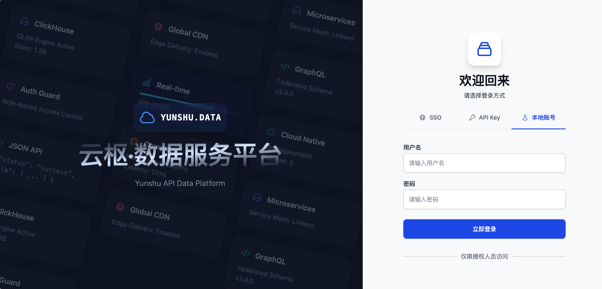
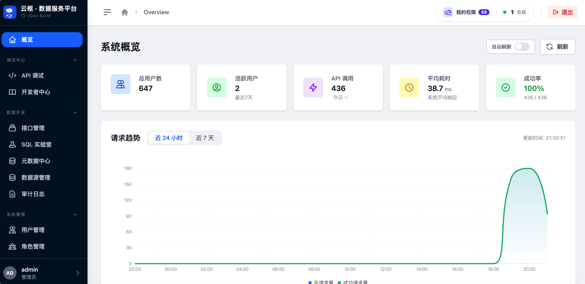
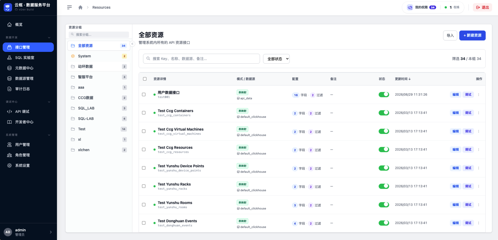
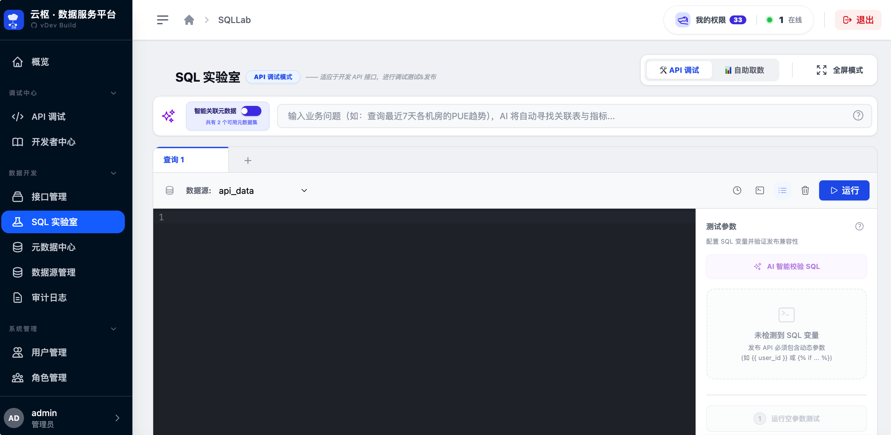
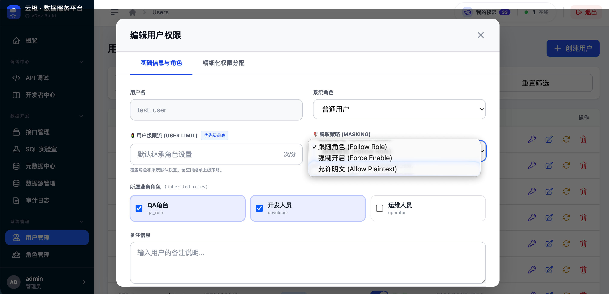
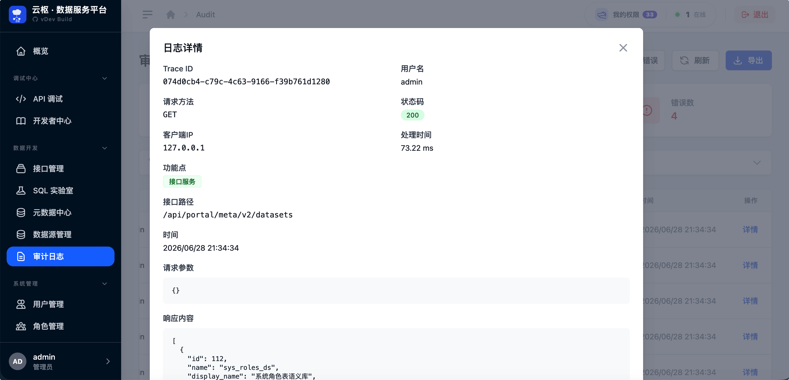
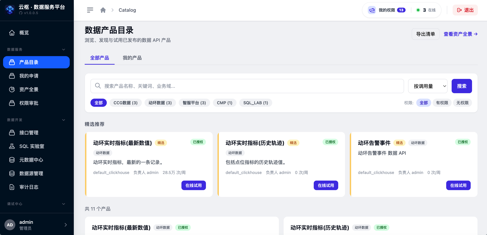
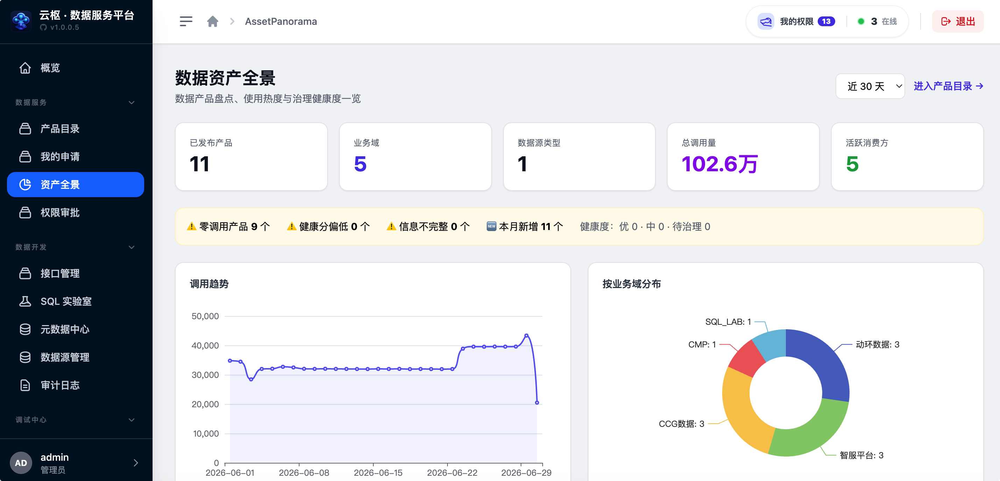

> **Project Notice**  
> This is a **personal open-source** project for free learning and exchange, released under the [MIT](LICENSE) License and free to redistribute.  
> The original name “Yunshu” (云枢) conflicted with other enterprise projects, so it has been renamed to “NanZi”.  
> “NanZi” comes from my long-used screen name, echoing the Chinese idiom **孜孜不倦** (diligent and tireless) — a nod to AI that keeps learning and evolving.

# NanZi API Data Platform (NanZi · 数据服务平台)

[简体中文](README.md) | **English**

> **Enterprise-grade Data API & Metadata Governance Platform**  
> *Connect Data. Serve Intelligence.*

[](https://www.python.org/) [](https://fastapi.tiangolo.com/) [](https://vuejs.org/) [](https://tailwindcss.com/) [](https://clickhouse.com/) [](https://www.mysql.com/) [](https://redis.io/) [](LICENSE)


**NanZi API Data Platform** is a one-stop **Data-as-a-Service (DaaS)** hub for enterprise data consumption. It wraps physical tables, custom SQL, and semantic metadata into governable, auditable, and observable RESTful APIs — providing standardized data access for AI agents, operations consoles, and business systems.

The platform focuses on the following core capability matrix:

*   🚀 **Resource-as-an-API**: Dual-mode `TABLE` zero-code mapping and `SQL` logic encapsulation; Jinja2 dynamic templates + unified DSL query entry.
*   🧪 **SQL Lab**: Online editing, debugging, AI-assisted SQL generation and repair; one-click publish to production API resources.
*   🗂️ **Metadata & Data Source Governance**: Multi-source connections (MySQL / ClickHouse / Oracle), semantic metadata, health scoring, and fine-grained RBAC.
*   📦 **Data Product Catalog**: Productized API publishing, domain browsing, access request/approval workflow, asset panorama KPIs, and call-volume insights.
*   🛡️ **Enterprise Security & Audit**: Daily-sharded audit logs, AST-based SQL guards, API Key + Session dual auth, data masking policies.
*   📊 **Full-Stack Observability**: 24h/7d call trends, Top rankings, minute-level stats aggregation, connection pool health monitoring.
*   🔌 **Open Integration**: Standardized `/api/v1` public APIs and Portal admin APIs; serves as the data foundation for **[NanZi AI Agent Platform](https://github.com/RandyChen1985/nanzi-ai-agent-platform)**.

---

## 🏛️ Architecture


---

## 🖼️ Interface Snapshots

| 🔐 Login | 📊 Observability Dashboard |
| :---: | :---: |
|  |  |
| **🚀 API Resource Management** | **🧪 SQL Lab** |
|  |  |
| **🛡️ RBAC & Roles** | **📋 Full-Chain Audit Logs** |
|  |  |
| **📦 Data Product Catalog** | **🌐 Asset Panorama** |
|  |  |

---

## 🌟 Core Capabilities


### 1. 🚀 Resource-as-an-API

*   **Dual-mode engine**: `TABLE` mode maps physical tables directly; `SQL` mode encapsulates complex query logic.
*   **Jinja2 dynamic templates**: Inject conditional branches in custom SQL for high-performance parameterized filtering.
*   **Unified query DSL**: `/api/v1/query` and `/api/v1/resources/{key}` support `EQ` / `IN` / `LIKE` / range filters.

### 2. 🧪 AI-Powered SQL Lab

*   **Intelligent SQL assistance**: LLM generation, syntax correction, and Chinese field label completion.
*   **Conversational analytics**: Streaming analysis reports with auto-generated ECharts visualization configs.
*   **One-click publish**: Promote debugged SQL to RBAC-controlled API resources instantly.

### 3. 🗂️ Metadata & Data Source Management

*   **Multi-source connection pools**: Unified management of MySQL, ClickHouse, and Oracle with role isolation.
*   **Semantic metadata**: Structured modeling of datasets, tables, fields, metrics, and entity relationships.
*   **Health governance**: Metadata health scores, creator tracking, and permission simulator.

### 4. 🛡️ Security, Audit & RBAC

*   **Fine-grained RBAC**: Permissions down to data sources, physical tables, API resources, and UI elements.
*   **Full-chain audit**: `api_access_logs_YYYYMMDD` daily sharding for high-volume log read/write.
*   **SQL safety guards**: `sqlparse` static analysis blocks `DELETE`/`DROP` and enforces `LIMIT`.
*   **Data masking**: Global / role / user-level masking strategies with configurable field rules.

### 5. 📊 Observability & Operations

*   **Real-time dashboard**: Call trends, Top APIs/users, online user statistics.
*   **Minute-level aggregation**: `APScheduler` async rollup into `api_access_stats_1m` for fast dashboards.
*   **Connection pool monitoring**: Per-data-source pool activity and health visualization.

### 6. 📦 Data Product Catalog & Asset Panorama

*   **Product publishing**: One-click or batch publish from resource management; full lifecycle from draft → published → offline.
*   **Catalog browsing**: Filter by business domain, call volume, and featured picks; published product metadata visible to all users with clear access status.
*   **Access requests**: Users without permission submit requests from product detail pages; owners/admins approve and resource permissions sync automatically.
*   **Asset panorama**: Domain distribution, zero-call alerts, KPI stats, and call trends (`/api/portal/catalog/panorama`).
*   **Governance tools**: Redundant product detection, CSV export, batch owner assignment, and Playground quick-debug entry points.

---

## 🔄 Typical Data Consumption Flow

1.  **Register data sources**: Configure MySQL / ClickHouse / Oracle connections in the admin console.
2.  **Define resources**: Create `sys_resource_meta` entries via table mapping or SQL Lab.
3.  **Publish to catalog**: Promote API resources as data products with domain, summary, owner, and other metadata.
4.  **Discover & request access**: Users browse and filter the catalog; submit access requests when needed; approved users gain API access.
5.  **External calls**: Clients call `/api/v1/query` or direct resource endpoints with `X-API-Key`.
6.  **Audit & trace**: All calls are logged in daily-sharded tables with Trace ID support.

See [architech/design/API_INTEGRATION_GUIDE.md](architech/design/API_INTEGRATION_GUIDE.md) · [docs/guides/getting-started.md](docs/guides/getting-started.md)

---

## 📚 Documentation

| Doc | Description |
|-----|-------------|
| [HOW_TO_INSTALL.md](HOW_TO_INSTALL.md) | Installation & FAQ |
| [architech/README.md](architech/README.md) | Architecture doc index |
| [architech/design/API_INTEGRATION_GUIDE.md](architech/design/API_INTEGRATION_GUIDE.md) | Public API integration guide |
| [architech/api-schema/sql_execution_api_usage.md](architech/api-schema/sql_execution_api_usage.md) | SQL execution API reference |
| [docs/guides/getting-started.md](docs/guides/getting-started.md) | Developer quick start |
| [architech/design/ORACLE_INTEGRATION_GUIDE.md](architech/design/ORACLE_INTEGRATION_GUIDE.md) | Oracle data source setup |
| [db-prod/README.md](db-prod/README.md) | Database migrations & idempotent apply tools |
| [docker/README.md](docker/README.md) | Docker build & deployment |
| [architech/design/redis_key_design.md](architech/design/redis_key_design.md) | Redis key design |
| [tests/CHECKLIST.md](tests/CHECKLIST.md) | Automated test checklist |

---

## 📂 Project Structure

```text
.
├── app/                  # Backend core (FastAPI)
│   ├── api/              # API layer (v1 public API / portal admin)
│   ├── core/             # Core config (middleware, DB, Redis)
│   ├── services/         # Business logic (metadata, auth, AI, query engine, catalog)
│   │   └── data_adapter/ # Multi-source adapters (MySQL / ClickHouse / Oracle)
│   ├── utils/            # Utilities (shard routing, encryption)
│   └── jobs/             # Scheduled jobs (stats aggregation, log cleanup)
├── frontend/             # Vue 3 admin console (Vite + TailwindCSS)
├── architech/            # Architecture docs & API schema notes
├── db-prod/              # DB migration scripts (V0-VNN) & apply tools
├── docker/               # Container packaging & Docker Compose deployment
├── docs/                 # Integration guides & ops docs
├── scripts/              # Ops helper scripts
├── tests/                # Pytest suites & verification checklist
└── openspec/             # OpenSpec change tracking
```

---

## 🚀 Quick Start

### Requirements

| Component | Version |
|-----------|---------|
| Python | 3.10+ (3.13 recommended) |
| Node.js | 18+ |
| MySQL | 8.0+ |
| Redis | 6.0+ (optional, recommended) |

### 🐳 Docker Deployment (Recommended)

**1. Configure environment**

```bash
cd docker
cp ../env.example .env   # DB, Redis, ENCRYPTION_KEY, etc.
```

**2. Build image and export tar**

| Script | Target |
| :--- | :--- |
| `./build_linux_x86.sh <version>` | x86_64 Linux servers (most common) |
| `./build_linux_arm.sh <version>` | ARM64 Linux (Kunpeng / Ampere, etc.) |
| `./build_native.sh <version>` | Host native arch — local testing only |

```bash
# Production (x86) — also use this on Mac when deploying to x86 servers
./build_linux_x86.sh 1.0.0
```

Artifacts are written to **`docker/release/`**, e.g. `nanzi-api_1.0.0_linux-amd64_20260628.tar`. Offline deployment:

```bash
docker load -i docker/release/nanzi-api_1.0.0_linux-amd64_*.tar
docker tag nanzi-api:1.0.0 nanzi-api:latest
```

> On Apple Silicon Macs deploying to x86 servers, use `build_linux_x86.sh`, not `build_native.sh`.

**If `docker buildx` is unavailable** (common with Homebrew `docker` + Colima):

```bash
./install-buildx.sh
./build_linux_x86.sh 1.0.0
```

See [docker/README.md](docker/README.md) for details.

**3. Start services**

```bash
./start-nanzi-api-server.sh
```

Service listens on **http://localhost:8000** (admin console, `/docs` API reference).

---

### 🛠️ Local Development

#### 1. One-Click Dev (Recommended)

```bash
./dev.sh
```

Cleans old builds, compiles the frontend, frees port 8000, and starts the backend with `--reload` in the background. Logs go to `app.log`.

#### 2. Step-by-Step Manual Setup

```bash
# 1. Setup environment
python3 -m venv venv && source venv/bin/activate
pip install -r requirements.txt
cp env.example .env

# 2. Database init (interactive, idempotent)
./db-prod/apply-sql.sh
# Without Python: ./db-prod/apply-sql-native.sh

# 3. Create admin (if INIT-USER-ADMIN.sql was skipped)
python3 scripts/create_admin_user.py

# 4. Build frontend
cd frontend && npm install && npm run build && cd ..

# 5. Start backend
uvicorn app.main:app --host 0.0.0.0 --port 8000 --reload
```

#### 3. Split Frontend / Backend Dev

```bash
# Terminal 1: backend
uvicorn app.main:app --reload --port 8000

# Terminal 2: frontend HMR
cd frontend && npm run dev
```

---

## 🔗 NanZi Ecosystem

This platform is the **data service layer** in the NanZi AI stack, complementing the [NanZi AI Agent Platform](https://github.com/RandyChen1985/nanzi-ai-agent-platform):

| Platform | Role |
|----------|------|
| **API Data Platform** (this repo) | Data APIs, metadata governance, SQL Lab, data product catalog, asset panorama, audit & RBAC |
| **AI Agent Platform** | AI chat, agent orchestration, ChatBI, knowledge base, MCP plugins |

---

## 🤝 Contributing

Issues and Pull Requests are welcome.

1. **Branching**: Develop from `main`; feature branches named `feature/your-feature-name`.
2. **Commit messages**: Write in **Chinese**, following [Conventional Commits](https://www.conventionalcommits.org/).
3. **Pull Request**: Use [PULL_REQUEST_TEMPLATE.md](PULL_REQUEST_TEMPLATE.md) when opening a PR.
4. **Testing**: Update [tests/CHECKLIST.md](tests/CHECKLIST.md) when adding features.
5. **DB changes**: Add `V{N}-description.sql` under `db-prod/`; migrations must be idempotent.

---

## 💬 Contact & Community

- **Issues**: Report bugs and feature requests on [GitHub Issues](https://github.com/RandyChen1985/nanzi-api-data-platform/issues).
- **Email**: Reach us via Issue comments.

If you have any questions, feature suggestions, or need further technical updates, please scan the QR code to follow our WeChat Official Account:


---

## 📄 License

This project is licensed under the [MIT License](LICENSE).

---

Copyright © 2025-2026 NanZi API Data Platform Contributors. All Rights Reserved.
