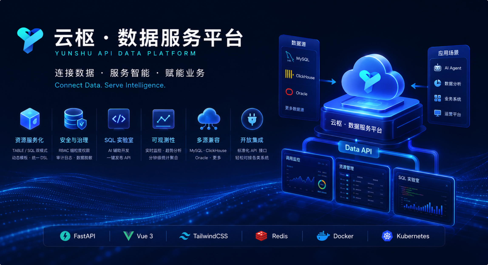

# 🎉 Yunshu API Data Platform v1.0.0 Release Notes

Welcome to the **first official release** of Yunshu API Data Platform (云枢 · 数据服务平台)! 🚀

**GitHub Repository**: [RandyChen1985/yunshu-api-data-platform](https://github.com/RandyChen1985/yunshu-api-data-platform)

v1.0.0 是云枢数据服务平台的**首个正式开源版本**，面向企业数据消费场景提供一站式 **Data-as-a-Service (DaaS)** 能力。平台将物理表、自定义 SQL 与语义元数据统一封装为可治理、可审计、可观测的 RESTful API，可作为 **[云枢 · 智能体平台](https://github.com/RandyChen1985/yunshu-ai-agent-platform)** 的标准化数据底座。

本次发布范围自 `73a1324`（含）至 `43849b7`，共 **10 个提交**，涵盖核心后端、Vue 3 管理后台、数据库迁移脚本、Docker 离线部署与完整开源文档资产。



---

## 🚀 Key Features

### 1. 🚀 动态资源服务化 (Resource-as-an-API)

* **双模式引擎**：`TABLE` 模式零代码映射物理表；`SQL` 模式封装复杂查询逻辑，支持 Jinja2 动态模板注入条件分支。
* **统一查询 DSL**：`/api/v1/query` 与 `/api/v1/resources/{key}` 支持 `EQ` / `IN` / `LIKE` / 范围比较等多维过滤器与分页排序。
* **资源生命周期管理**：资源状态映射、缓存 TTL 配置、资源 Key 长度扩展与细粒度发布管控。

### 2. 🧪 AI 驱动的 SQL 实验室 (SQL Lab)

* **智能 SQL 辅助**：LLM 生成、语法纠错、字段中文标签补全，支持流式对话式分析。
* **安全预览与执行**：`sqlparse` 静态分析拦截 `DELETE`/`DROP` 等高危操作，强制 `LIMIT`；支持 Oracle / ClickHouse / MySQL 多源预览。
* **一键发布**：调试通过的 SQL 即时发布为受 RBAC 管控的 API 资源。

### 3. 🗂️ 元数据与多源数据源治理

* **多源连接池**：统一管理 MySQL、ClickHouse、Oracle 连接，支持连接测试、拖拽排序与角色隔离。
* **语义元数据 V2**：数据集、表、字段、指标与实体关系的结构化建模；AI 智能发现指标、YAML 生成与血缘分析。
* **健康度治理**：元数据健康评分、创建人追踪、向量同步状态与权限模拟器。

### 4. 🛡️ 企业级安全、审计与 RBAC

* **细粒度 RBAC**：权限精确到数据源、物理表、API 资源点与 UI 元素；角色成员批量分配与缓存失效。
* **全链路审计**：`api_access_logs_YYYYMMDD` 按天分表，支持 Trace ID、高级过滤与导出。
* **数据脱敏**：全局 / 角色 / 用户级脱敏策略，字段规则可配置。
* **双认证体系**：API Key + Session 双通道；个人 API Key 管理与限流配置。

### 5. 📊 全链路可观测性与运维

* **实时看板**：24h/7d 调用趋势、Top 接口/用户、在线用户统计与最近活动。
* **分钟级聚合**：`APScheduler` 异步汇总 `api_access_stats_1m`，看板秒开。
* **连接池监控**：各数据源连接池活跃度与健康状态可视化；系统资源监控（CPU/内存/磁盘/Redis）。

### 6. 🔌 开放集成与生态互补

* **标准化对外 API**：`/api/v1` 公开接口与管理后台 Portal API，配套 [API 集成指南](https://github.com/RandyChen1985/yunshu-api-data-platform/blob/main/architech/design/API_INTEGRATION_GUIDE.md)。
* **智能体平台对接**：可作为云枢 AI 智能体平台的 Data API 与元数据治理层，为 ChatBI / Agent 提供标准化数据访问。
* **Oracle 专项支持**：Thin / Thick 双驱动适配，详见 [Oracle 集成指南](https://github.com/RandyChen1985/yunshu-api-data-platform/blob/main/architech/design/ORACLE_INTEGRATION_GUIDE.md)。

### 7. 📄 文档与开源资产

* **双语 README**：中英文 README，含系统架构图、核心能力全景图与 6 张管理后台界面截屏。
* **部署指南**：[HOW_TO_INSTALL.md](https://github.com/RandyChen1985/yunshu-api-data-platform/blob/main/HOW_TO_INSTALL.md) 覆盖 Docker 离线部署与本地开发联调。
* **一键开发脚本**：`dev.sh` 自动编译前端、释放端口并以 `--reload` 模式启动后端。

---

## ⚠️ First Deploy Notes (首次部署注意事项)

> 首次部署 v1.0.0 时，请特别注意以下事项：

| 项目 | 说明 |
| :--- | :--- |
| **数据库初始化** | 须通过 `./db-prod/apply-sql.sh` 或 `./db-prod/apply-sql-native.sh` 执行 V0–V25 全量迁移脚本（幂等可重复执行）。 |
| **管理员账号** | 可导入 `INIT-USER-ADMIN.sql` 或运行 `python3 scripts/create_admin_user.py` 创建初始管理员。 |
| **加密密钥** | 生产环境务必在 `.env` 中配置独立的 `ENCRYPTION_KEY`，勿使用示例默认值。 |
| **Redis（推荐）** | 建议开启 `REDIS_ENABLE=true`，用于缓存、限流与异步统计聚合。 |
| **Docker 架构** | Mac（Apple Silicon）打 x86 服务器包请使用 `docker/build_linux_x86.sh`，勿用 `build_native.sh`。 |

---

## 🗄️ Database Schema (数据库结构说明)

v1.0.0 首次部署包含 **25 个**版本化迁移脚本（存放于 [db-prod/](https://github.com/RandyChen1985/yunshu-api-data-platform/tree/main/db-prod) 目录）：

| 脚本范围 | 核心变更内容 |
| :--- | :--- |
| **V0–V9** | 动态资源配置、数据源管理、SQL 执行、用户认证、审计索引、分钟级统计聚合、系统配置与维护日志。 |
| **V10–V14** | AI 配置初始化、RBAC 与 UI 权限、限流配置、审计动作类型、按天分表审计日志模板。 |
| **V15–V18** | 数据源排序、废弃日志表清理、数据脱敏策略。 |
| **V19–V25** | 语义元数据、元数据 RBAC、AI Embedding/Rerank 配置、健康评分与创建人追踪。 |

> [!WARNING]
> 请在部署前通过执行 `./db-prod/apply-sql-native.sh` 脚本，将全量 SQL 自动、安全地导入到目标 MySQL 数据库中。

---

## 📦 Quick Start

请参考项目根目录下的 [HOW_TO_INSTALL.md](https://github.com/RandyChen1985/yunshu-api-data-platform/blob/main/HOW_TO_INSTALL.md) 进行部署。

### 本地快速开发模式启动：

```bash
# 1. 准备并配置本地 python venv 虚拟环境
python3 -m venv venv
source venv/bin/activate
pip install -r requirements.txt
cp env.example .env

# 2. 运行初始化 SQL 脚本
./db-prod/apply-sql-native.sh

# 3. 一键开发联调（推荐）
./dev.sh
```

### Docker 离线部署：

```bash
cd docker
cp ../env.example .env
./build_linux_x86.sh 1.0.0
docker load -i release/yunshu-api_1.0.0_linux-amd64_*.tar
docker tag yunshu-api:1.0.0 yunshu-api:latest
./start-yunshu-api-server.sh
```

---

## ✅ Test Checklist

部署后建议验证以下核心场景：

- [ ] **动态资源 API**：`/api/v1/resources/{key}` 分页、过滤、排序与鉴权隔离。
- [ ] **统一查询**：`/api/v1/query` 多维 DSL 过滤与安全校验。
- [ ] **SQL 实验室**：多源预览、AI 生成/修复、高危 SQL 拦截与一键发布。
- [ ] **数据源管理**：MySQL / ClickHouse / Oracle 连接测试、CRUD 与排序。
- [ ] **元数据 V2**：语义元数据 CRUD、AI 指标发现、血缘分析与权限模拟。
- [ ] **RBAC**：角色成员分配、数据源/表/资源点细粒度授权。
- [ ] **审计日志**：按天分表写入、高级过滤、Trace ID 排障与导出。
- [ ] **可观测看板**：调用趋势、Top 排行、在线用户与连接池健康。
- [ ] **回归测试**：运行 `pytest tests/`，确保核心用例通过。

完整测试清单见 [tests/CHECKLIST.md](https://github.com/RandyChen1985/yunshu-api-data-platform/blob/main/tests/CHECKLIST.md)。

---

## 💾 Downloads / Assets

本项目 v1.0.0 发布版本关联的源码、Docker 镜像资产归档包及配置文件如下：

* 📦 **Source Code (zip)**: `yunshu-api-data-platform-1.0.0.zip`
* 📦 **Source Code (tar.gz)**: `yunshu-api-data-platform-1.0.0.tar.gz`
* 🐳 **Docker Image for Linux amd64 (x86_64)**: `yunshu-api_1.0.0_linux-amd64_*.tar`
* 🐳 **Docker Image for Linux arm64 (aarch64)**: `yunshu-api_1.0.0_linux-arm64_*.tar`
* ⚙️ **Docker Compose YAML file**: `docker-compose.yml`

🔗 **下载地址**: [GitHub Releases v1.0.0](https://github.com/RandyChen1985/yunshu-api-data-platform/releases/tag/1.0.0)

### 🐳 如何在离线/内网环境加载 Docker 镜像归档：

```bash
# 1. 加载本地镜像归档
docker load -i yunshu-api_1.0.0_linux-amd64_*.tar

# 2. 检查是否加载成功
docker images | grep yunshu-api

# 3. 利用启动脚本快速拉起服务
cd docker && ./start-yunshu-api-server.sh
```

---

## 📋 Commit Log

| Hash | 描述 |
| :--- | :--- |
| `43849b7` | docs: 新增功能界面截屏并集成到 README |
| `708d592` | docs: 更新 README 配图资源并整理图片文件 |
| `57cbfe5` | Merge branch 'dev' |
| `d34e67c` | docs: 补充提交 overview2 概览图资源 |
| `da2b585` | docs: README 核心能力章节补充功能全景图 |
| `bc3fe6b` | Merge pull request #1 from RandyChen1985/dev |
| `dde6696` | docs: README 补充概览图与技术架构图 |
| `acb5025` | docs: 更新 README 与安装指南中的 GitHub 链接 |
| `e570c4f` | chore: 开源协作与文档整理 |
| `73a1324` | feat: 云枢数据服务平台首次开源发布 |

---

## 🤝 Contributors

感谢所有参与 v1.0.0 版本发布的开发者！

For complete test coverage check out [tests/CHECKLIST.md](https://github.com/RandyChen1985/yunshu-api-data-platform/blob/main/tests/CHECKLIST.md).
