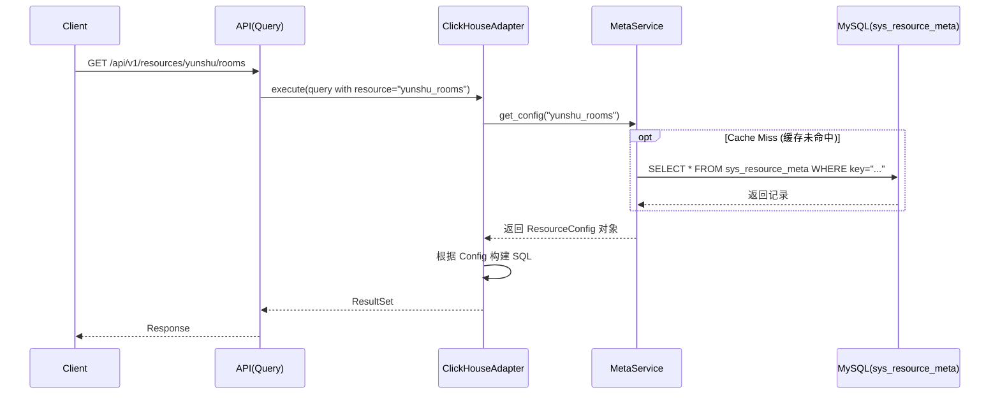

# 设计：动态资源配置管理

## 架构 (Architecture)

### 1. 数据库 Schema
新增 MySQL 表: `sys_resource_meta`

| 列名 | 类型 | 说明 |
| :--- | :--- | :--- |
| `id` | `BIGINT` | 主键 |
| `resource_key` | `VARCHAR(100)` | API 中使用的唯一键 (如 `yunshu_rooms`) |
| `resource_name` | `VARCHAR(100)` | 可读名称 (如 `南孜机房`) |
| `resource_group` | `VARCHAR(50)` | 分组名称 (如 `南孜 (NanZi)`), 用于文档Tag和权限分类 |
| `data_source` | `VARCHAR(50)` | 适配器类型 (枚举值: `clickhouse`, `mysql`, `hbase`, `api`)，用于后续扩展 |
| `resource_mode` | `VARCHAR(20)` | 资源模式: `TABLE` (物理表) 或 `SQL` (自定义查询) |
| `table_name` | `VARCHAR(200)` | 物理对象名 (仅 `TABLE` 模式有效) |
| `custom_sql` | `TEXT` | 自定义 SQL 语句 (仅 `SQL` 模式有效)，作为子查询数据源 |
| `connection_config` | `JSON` | (可选) 针对特定数据源的连接覆盖配置 |
| `fields_config` | `JSON` | 字段定义列表 (包含字段名、类型等) |
| `filter_config` | `JSON` | 允许筛选的字段列表 |
| `sort_config` | `JSON` | 默认排序字段和方向 |
| `created_at` | `DATETIME` | 创建时间 |
| `updated_at` | `DATETIME` |更新时间 |

### 2. 服务层重构

#### `DataAdapterFactory` (增强)
- 改造工厂模式，使其支持根据 `ResourceConfig.data_source` 字段实例化不同的适配器。
- 支持新类型的轻松注册（Open-Closed Principle）。

#### `ClickHouseAdapter` (Update)
- 适配器需根据 `resource_mode` 调整 SQL 构建逻辑。
- **TABLE 模式**: `FROM {table_name}`
- **SQL 模式**: `FROM ({custom_sql}) AS _subquery` (Subquery Wrapping)
    - 允许管理员编写复杂的 JOIN/GROUP BY 逻辑，系统仍能在外层自动叠加分页 (`LIMIT/OFFSET`) 和过滤 (`WHERE`).
    - *注意*: 需校验 Custom SQL 不包含结尾的分号，防止语法错误。

### 3. 前端设计 (Frontend Design)
- **技术栈**: Vue 3 + TailwindCSS + Element Plus
- **页面结构**:
    - `/admin/resources` (列表页): 卡片式展示，支持搜索和筛选。
    - `/admin/resources/edit/:id?` (编辑/新建页): 
        - **基本信息**: 表单输入 (Key, Name, etc.)。
        - **所有字段 (Fields)**: 可视化表格编辑器 (新增行/删除行)，支持从数据库 Schema **自动抓取** 填充。
        - **筛选字段 (Filters)**: 多选穿梭框 (Transfer) 或 Tag 输入框，从“所有字段”中选择。
        - **高级配置**: 使用 `Monaco Editor` 提供 JSON 代码高亮编辑 (用于 Connection Config 等复杂结构)。
- **交互体验**:
    - **自动补全**: 输入物理表名时，尝试调用后端 API 获取数据库中的真实列名，辅助用户填写的 Fields 列表。
    - **实时测试 (Interactive Preview)**:
        - 侧边栏提供 **"测试控制台"** 面板。
        - **动态筛选表单**: 根据配置的 `Filter Fields` 自动生成输入框（如 `status` 生成文本框，`time` 生成日期选择器）。
        - **执行**: 点击 "运行测试"，能够查看实际返回的 JSON 数据和表格视图。
        - **调试信息**: (可选) 显示后端实际生成的 SQL 语句，方便排查问题。
    - **操作引导**:
        - **模式切换**: 选择 `SQL` 模式时，显示显眼的 Warning / Tooltip: "SQL 模式下的查询将被作为子查询执行，请勿包含结尾的分号 (;)"。
        - **占位提示 (Placeholder)**:
            - Table 输入框: "例如: ck_fact_access_log"
            - SQL 输入框: "例如: SELECT user_id, count(*) as cnt FROM access_log GROUP BY user_id"

### 4. API 变更
- **管理端 (Admin Portal)**: `app/api/portal/endpoints/meta.py`
    - (略... 保持不变)

- **数据端 (Data API)**: `app/api/v1/endpoints/data.py` (新增)
    - `GET /api/v1/resources/{resource_key}`: **通用资源查询接口**。
        - 接收 standard pagination params (`page`, `size`, `sort`)。
        - 接收 dynamic filters (e.g. `?status=running&user_id=100`).
        - 原理: 解析 URL 路径中的 `resource_key`，从 MetaService 获取配置，然后调用 Adapter。
        - **效果**: 新增资源配置后，该接口立即可用，无需写任何 Python 代码。
    - **API 文档 (OpenAPI/Swagger)**:
        - 默认情况下，Swagger 只会显示一个通过 `{resource_key}` 的通用接口。
        - **增强**: 实现 `custom_openapi` 钩子。
        - **逻辑**: 在生成文档时，从 MetaService 获取所有已注册的资源列表，动态构建 OpenAPI `paths` 对象。
        - **分组 (Tagging)**: 将 `resource_group` 字段的值作为 OpenAPI 的 tags。
        - **结果**: Swagger UI 将清晰列出 `/api/v1/resources/yunshu_rooms`, `/api/v1/resources/audit_logs` 等独立条目，并自然归类（例如 "南孜" 组, "动环" 组），且参数说明会根据配置的 `allowed_filters` 自动生成。

### 5. 安全设计 (Security Design)
- **管理端 (Admin)**: 所有的元数据管理接口 (`/api/portal/meta/*`) 均需 `verify_role(["admin"])`。
- **数据端 (Data Access)**:
    - 通用接口 `GET /api/v1/resources/{resource_key}` 将复用现有的 `check_resource_permission` 依赖。
    - **逻辑**: `Depends(check_resource_permission(path_param="resource_key"))`。
    - **原理**: 当请求 `/api/v1/resources/audit_logs` 时，中间件会检查当前用户是否有 `audit_logs` 的访问权限。
    - **绑定方式**: 权限系统（现有的 `sys_permissions` 或类似表）中需要有对应的 `resource_key` 记录。建议在创建新资源时，**自动同步**往权限表中插入一条对应记录，便于随后在角色管理页面勾选。
    - **权限分组**: 同步时将 `resource_group` 写入权限描述或 Group 字段（视权限系统结构而定），使前端在渲染权限树时能按组展示。

## 扩展性设计 (Extensibility)
- **新数据源支持**: 只需实现 `DataSourceAdapter` 抽象基类，并在 Factory 中注册新的 `data_source` 类型字符串即可。无需修改 MetaService。
- **配置结构**: `fields_config` 和 `filter_config` 采用 JSON 存储，允许不同数据源有不同的配置 Schema（例如 HTTP 数据源可能需要 `headers` config）。

## 时序图 (Sequence Diagram)

